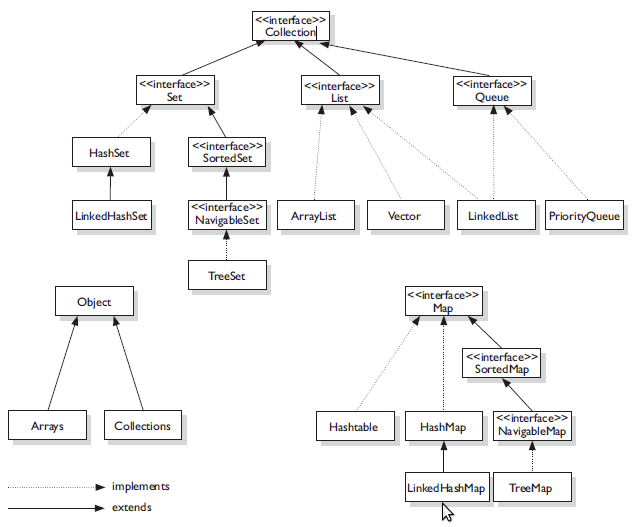
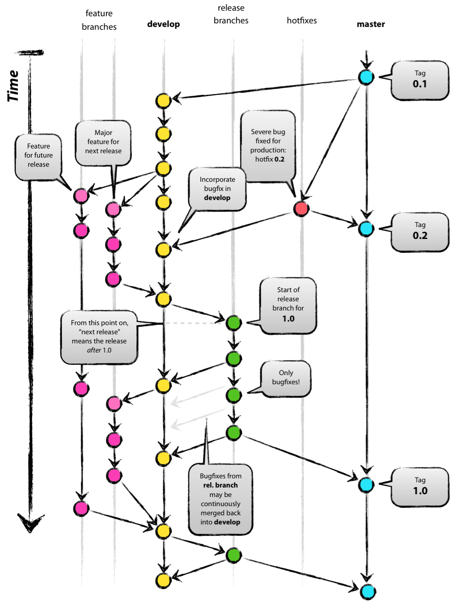
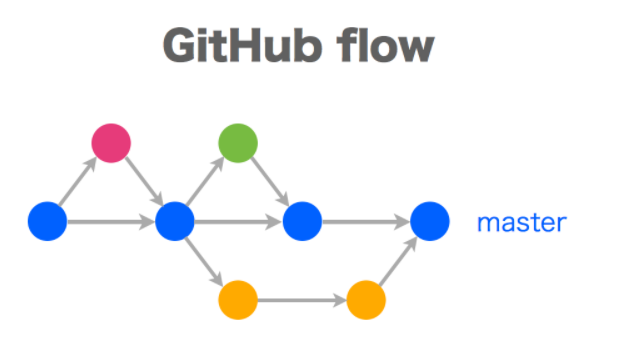

# F-Lab

## 2022.06 ~
- ArrayList 직접구현
- LinkedList 직접구현
  - doubly
  - sentinel
- Stack 직접구현
- Queue 직접구현
- 

------------------
# Git Branch Strategy
- GitFlow
- GithubFlow

## GitFlow
- master : 기준이 되는 브랜치로 제품을 배포하는 브랜치
- develop : 개발 브랜치로 개발자들이 이 브랜치를 기준으로 각자 작업한 기능들을 Merge
- feature : 단위 기능을 개발하는 브랜치로 기능 개발이 완료되면 develop 브랜치에 Merge
- release : 배포를 위해 master 브랜치로 보내기 전에 먼저 QA(품질검사)를 하기위한 브랜치
- hotfix : master 브랜치로 배포를 했는데 버그가 생겼을 떄 긴급 수정하는 브랜치

### 사용법
1. master 브랜치에서 develop 브랜치를 분기합니다.
2. 개발자들은 develop 브랜치에 자유롭게 커밋을 합니다.
3. 기능 구현이 있는 경우 develop 브랜치에서 feature-* 브랜치를 분기합니다. 
4. 배포를 준비하기 위해 develop 브랜치에서 release-* 브랜치를 분기합니다. 
5. 테스트를 진행하면서 발생하는 버그 수정은 release-* 브랜치에 직접 반영합니다. 
6. 테스트가 완료되면 release 브랜치를 master와 develop에 merge합니다.

------------------
## GithubFlow
- master : 기준이 되는 브랜치로 제품을 배포하는 브랜치
  - github flow는 git flow의 브랜치 전략이 너무 복잡하고 적용하기 어렵다고 해서 생겨난 브랜치 전략이다.
  - github flow는 master 브랜치 하나만을 가지고 진행하는 방식이다.
  - master 브랜치는 어떤 기능이 구현되든, 오류가 수정되든 모두 master에 머지되어 항상 update된 상태를 유지한다.

### 사용법
1. master 브랜치에서 개발이 시작된다.
2. 기능 구현이나 버그가 발생하면 issue를 작성한다.
3. 팀원들이 issue 해결을 위해 master 브랜치에서 생성한 feature/{구현기능} 브랜치에서 개발을 하고 commit log를 작성한다.
4. push를 하면 pull request를 날릴 수 있다.
5. pull request를 통해 팀원들 간의 피드백, 버그 찾는 과정이 진행된다. release 브랜치가 없으므로 이 과정이 탄탄하게 진행되어야 한다.
6. 모든 리뷰가 이루어지면, merge하기 전에 배포를 통해 최종 테스트를 진행한다.
7. 테스트까지 진행되면 master 브랜치에 머지한다.

------------------